# Create Service Account for release application to google play

1. Enable API access on Google Play Console  
1.1 Go to the Google Play console and go to Settings > Developer account > API access     

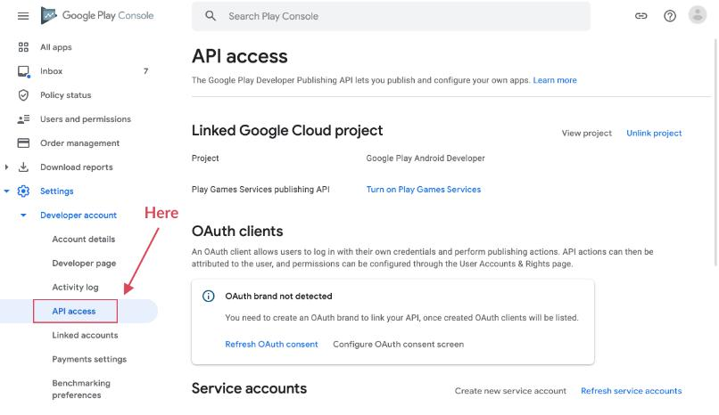  

1.2 Choose a project to link and agree to the terms and conditions.  

1.3 Click on the link to create a service account  

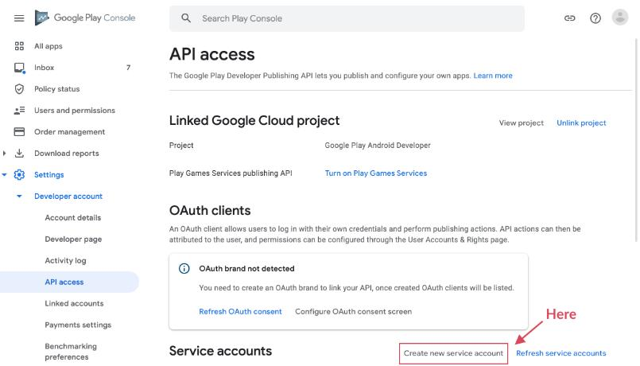   

1.4. Click on the link to go to the Google Cloud Platform    

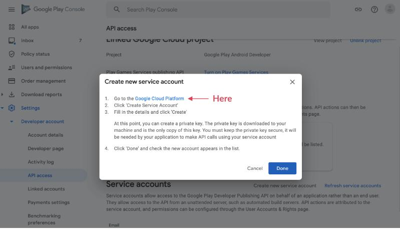  

2. Configure Google Cloud Platform  

2.1. Click on the link to create a service account

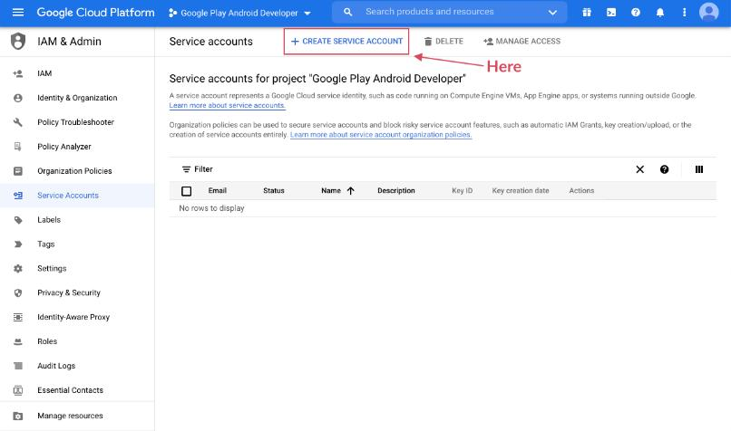  

2.2. Enter service account name and description and click on the create button  

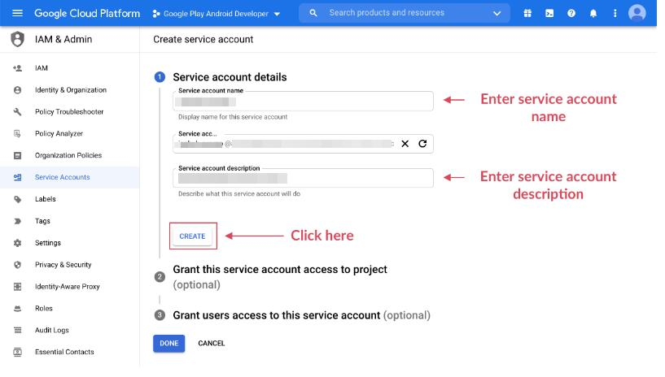  

2.3. Select Owner role and click on the done  

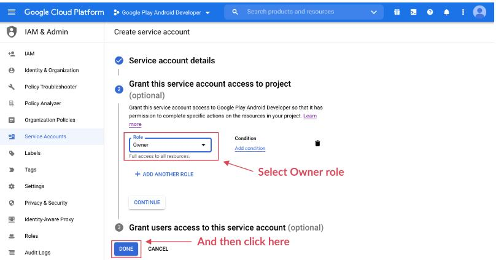  

2.4. Open the actions menu and click on Manage keys  

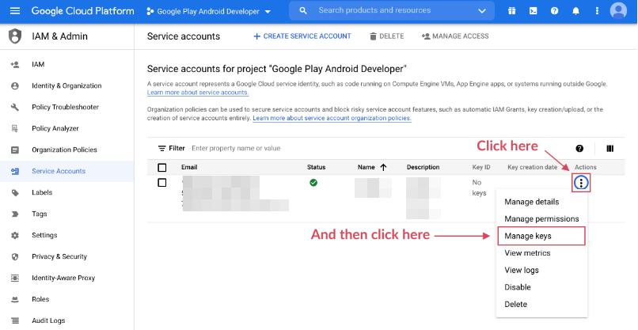  

2.5. Click on Add Key and then click on Create new key  

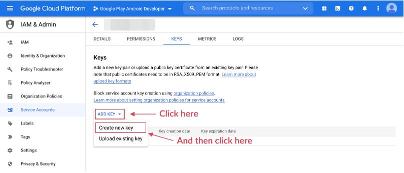  

2.6. Select JSON and click on Create  

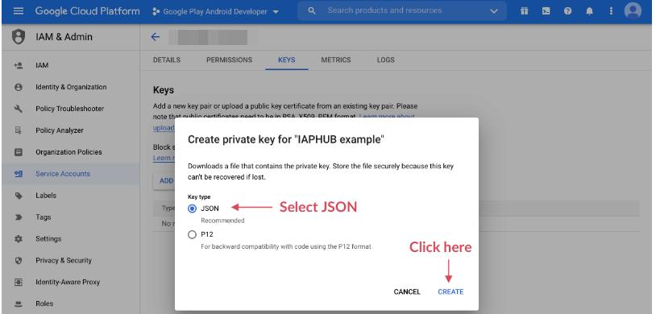  

2.7. A JSON file should be downloaded, it gives access to the service account.  

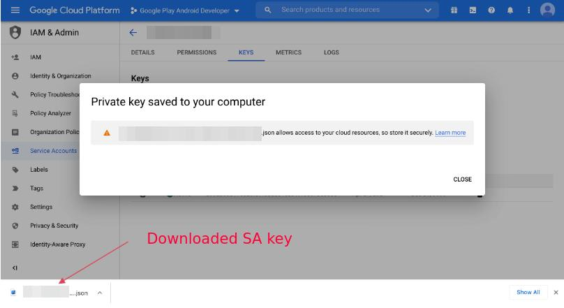  

3. Configure API access on Google Play Console  

3.1. Go back to the API access page of the Google Play Console, your service account should appear, click on Grant access  

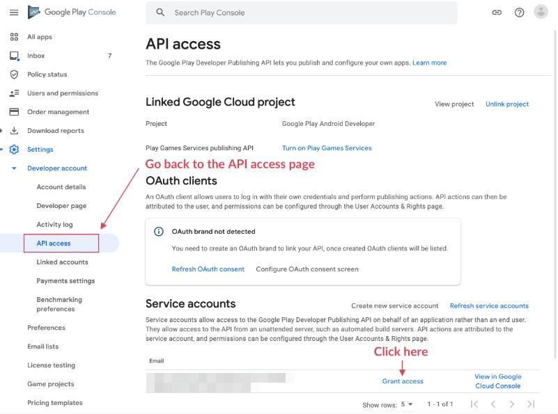  

3.2. Enable the 3 permissions bellow and click on Invite user  

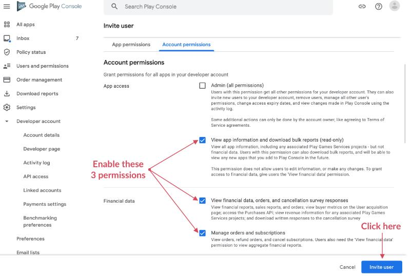  

3.3. A modal should appear, click on Invite user  

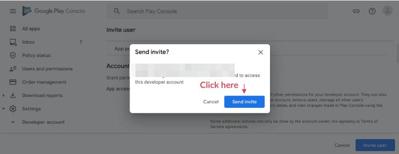  

3.4. You should be redirected to the Users and permissions page, click on your service account  

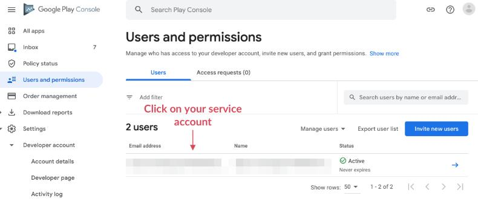  

3.5. Click on Add app, select your app and click on Apply  

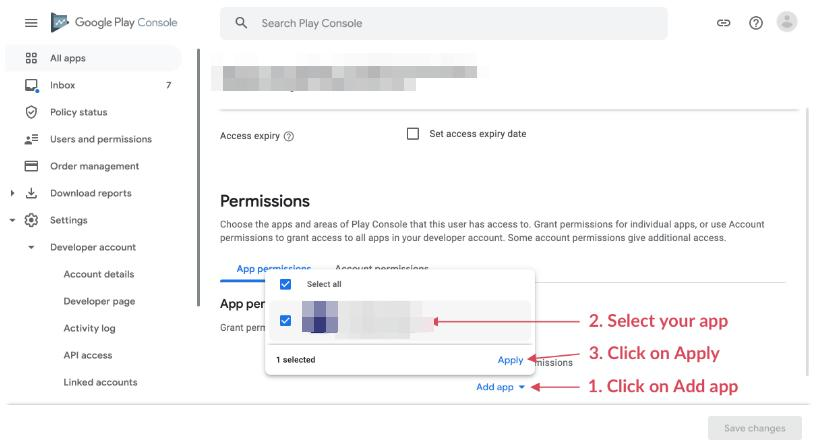  

3.6. A modal should appear, click on Apply  

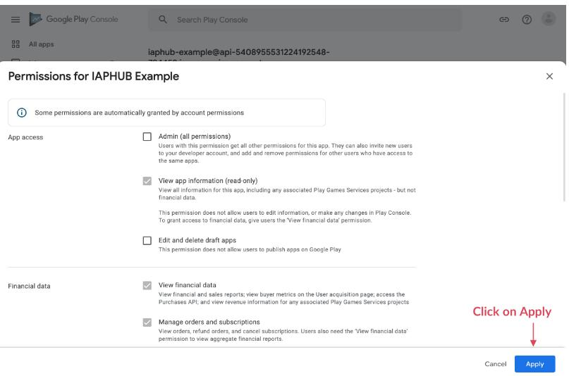  
