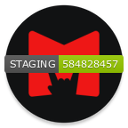
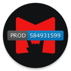

# Бойлер для подготовки CI/CD для Android приложений

[](https://maddevs.io?utm_source=github&utm_medium=madboiler)
[](https://github.com/maddevsio/android-ci-cd/blob/main/LICENSE.md)

Больше нет необходимости публиковать Android-приложения вручную. Начните делать это полностью автоматически на любом этапе (test, beta и prod).

👇  Посмотрите этот 5-минутный видеоролик, чтобы лучше понять подход и преимущества.👇
[](https://youtu.be/poSugKUtBPU)

---

## Преимущества бойлера

* **Быстрый запуск CI/CD**: С помощью этого бойлера вы сможете легко создать CI/CD для вашего android-приложения на основе платформы [Fastlane](https://fastlane.tools/).
* **Простая адаптация к внешним инструментам CI/CD**: Мы используем GitLab-ci или GitHub actions в качестве исполнителя команд Fastlane и построения процесса сборки и поставки.
* **Уведомления**: Получение уведомления в Slack об успешных операциях или ошибках в процессе выполнения пайплайна.
* **Нет необходимости в настройке специальной машины для сборки**: Мы собираем приложение внутри docker контейнера со всеми установленными зависимостями; это обеспечивает переносимость и возможность использования стандартных GitHub agents или GitLab runners.

## CI/CD

* Давайте прежде всего ответим на некоторые вопросы:
  * [Что такое CI/CD?](https://ru.wikipedia.org/wiki/CI/CD)
    * CI/CD позволяет повысить производительность за счет автоматизации. Как и в производственной промышленности, вы можете автоматизировать повторяющийся процесс сборки (в нашем случае сборку приложений) с помощью автоматизированных задач, позволяя разработчикам сосредоточиться на процессах проектирования и разработки.
  * Какие есть преимущества использования CI/CD в мобильной разработке?
    1. `Быстрые циклы выпуска релизов`
       * Благодаря CI/CD разработчики могут вносить даже самые незначительные изменения в код, поскольку они будут собираться и доставляться автоматически в фоновом режиме. Этот автоматизированный процесс гарантирует, что всегда есть альфа или бета релиз, готовый к тестированию с актуальным кодом.
    2. `"Непрерывная интеграция(CI)" позволяет получать быстрый фидбек`
       * При более быстром цикле выпуска релизов с меньшим количеством изменений становится проще определить источник ошибки. Это особенно важно для больших команд, где конфликты кода могут вызвать значительные проблемы.
    3. `Повышение дисциплины написания кода с помощью сборки на основе запросов и автоматизированных тестов`
       * С коммитом “pull request-а” сборка происходит до слияния кода в главную ветку и после каждого слияния проводятся автоматические unit-тесты и проверка кода; сам код тестируется более тщательно, прежде чем он становится частью релиза.
    4. `"Непрерывное развертывание(CD)" позволяет предупреждать ошибки и тщательнее тестировать`
       * Благодаря тестированию каждого отдельного изменения с помощью нескольких этапов процесса тестирования, проблемы в коде могут быть выявлены быстрее.
    5. `Упрощение сложностей, связанных с доставкой приложений`
       * Каждая дисциплина разработки имеет свой набор сложностей, и мобильные приложения не являются исключением. В Android существуют совершенно независимые и различные процессы создания, подписания, распространения и установки приложений. CI/CD помогает автоматизировать этот процесс.

### Описание CI/CD

* Эта диаграмма описывает процесс, который мы используем


* Описание этапов

```
  - build base image                - Этап сборки базового образа, который используется для сборки приложения.
  - tests and lints                 - Этап для прогона тестов и линтов.
  - build and deploy to firebase    - Этап сборки и загрузки приложения в Firebase.
  - build and deploy to google play - Этап сборки и загрузки приложения в Google Play.
```

* Стоит пояснить, для чего используются несколько билдов.

Условия и положения:
* Приложения в формате `apk` не могут быть загружены в Google Play
* Приложения в формате `aab` могут быть загружены в Firebase и Google Play

Поэтому нам нужно создать несколько билдов.

* Для удобства тестирования, на этапе `Merge Request` мы даем возможность собрать приложение по запросу и отправить его в `Firebase`.
* Это удобно для проверки приложения без слияния кода в основную ветку.
* Приложение в формате `apk` загружается в Firebase.

### Особенности

* GitLab:
  * У нас есть ручной этап по загрузке приложения в Google Play.
  * У нас есть ручной этап по созданию и загрузке приложения в staging `Firebase`; этот шаг доступен в `Merge Request`.
* GitHub:
  * Мы используем [trstringer/manual-approval](https://trstringer.com/github-actions-manual-approval/) action, который помогает создать ручной шаг approve(одобрения) при загрузке в Google Play.
  * Мы используем ручной шаг - `workflow_dispatcher` для сборки и загрузки приложения из любой ветки.
* Плагин Fastlane для создания значка.
  * Этот плагин поможет добавить значок к иконке вашего приложения для Android.
  * Более подробная информация [здесь](https://docs.fastlane.tools/actions/badge/)
  * Вы всегда можете настроить его для своего проекта, вот примеры того, как это используем мы

         

### Инструменты и сервисы

* [Fastlane](https://fastlane.tools/) - это инструмент для разработчиков IOS и Android, позволяющий автоматизировать такие рутинные задачи, как создание скриншотов, работа с профилями инициализации, сборка и загрузка приложения.
* [GitLab-ci](https://docs.gitlab.com/ee/ci/) или [GitHub Actions](https://docs.github.com/en/actions) - Системы CI/CD используются для построения логики пайплайна и выполнения команд Fastlane.
* [Docker](https://www.docker.com/) - Docker используется в качестве среды сборки для приложения.
* [CGP](https://cloud.google.com/)
  * [Firebase](https://firebase.google.com/docs/app-distribution) - Тестовая среда для приложения.
  * [Google Play](https://play.google.com/console/about/) - Продуктовая среда для приложения.

### Описание основных компонентов


### Структура репозитория

```commandline
.
├── app                   - Папка, содержащая пример приложения
│   ├── build.gradle      - Файл для конфигурации Android проекта
│   └── src
├── build.gradle
├── Dockerfile            - Dockerfile для базового образа, который используется на этапе сборки
├── docs                  - Папка для документации
├── fastlane              - Папка с конфигурацией Fastlane
│   ├── Appfile           - Файл для основной конфигурации Fastlane
│   ├── Fastfile          - Файл для конфигурации команд Fastlane
│   └── Pluginfile        - Файл для конфигурации дополнительных плагинов или зависимостей Fastlane
├── Gemfile
├── gradle                - Папка для сборки Gradle
├── gradle.properties     - Файл для конфигурации Gradle
├── gradlew
├── gradlew.bat
├── ic_launcher-web.png
├── libs
├── proguard-project.txt
├── project.properties
├── README.md
└── settings.gradle       - Файл для настроек Gradle
```

### Для начала:
1. [Создайте аккаунт в Google Cloud Platform](https://cloud.google.com/)
2. [Создайте проект Google](https://cloud.google.com/resource-manager/docs/creating-managing-projects)
3. [Создайте проект Firebase и активируйте "App Distribution"](https://cloud.google.com/firestore/docs/client/get-firebase)
4. [Создайте аккаунт разработчика Google Play](https://play.google.com/console/about/)

#### Подготовка ключей и переменных окружения
1. Json-файл с конфигурацией для Firebase
    * Вы должны добавить json-файл с настройками проекта Firebase, закодированными в base64, в переменную окружения.
      > https://firebase.google.com/docs/android/setup - Этап 3 
      ```bash
      base64 google-services.json > firebase_setting
      ```

2. Сервис аккаунт с доступом к Firebase
    * Создайте сервис аккаунт для загрузки приложения на Firebase
      > Choose your Firebase account --> Project Overview --> Project setting --> Service Account --> create service account
    * Добавьте ключ сервис аккаунта(SA), закодированный в base64, в переменную окружения.
      ```bash
      base64 sa.json > key_firebase
      ```

3. Сервис аккаунт с доступом к Google Play
    * Создайте сервис аккаунт для загрузки приложения в [Google Play](./README_GOOGLE_PLAY.md)
    * Добавьте ключ сервис аккаунта(SA), закодированный в base64, в переменную окружения
      ```bash
      base64 google_play.json > google_play
      ```

4. Хранилище ключей для подписи приложения
    * Чтобы зарегистрировать приложение, необходим ключ, который можно сгенерировать с помощью команды.
      ```bash
      keytool -genkey -v -keystore my-release-key.keystore -alias alias_name -keyalg RSA -keysize 2048 -validity 10000
      ```
    * Добавьте хранилище ключей, закодированное в base64, в переменную окружения.
      ```bash
      base64 my-release-key.keystore > keystore
      ```

##### GitLab CI/CD

* Мы используем окружения `Environments` в нашем пайплайне, чтобы разделить наши переменные по окружениям; перед началом работы создайте 3 окружения в `gitlab-ci-cd`:

```
GitLab --> Deployments --> Environment --> New Environment
```

* Нам необходимо создать три окружения:
  * staging
  * prod
  * prod-gp

##### GitHub Actions

* Мы можем использовать окружения в GitHub Actions, но этот функционал доступен только в публичных репозиториях или в корпоративных подписках.
* В этом бойлерплейте мы не используем окружения в GitHub Actions.

##### Подготовьте переменные окружения
1. Скопируйте содержимое этого файла `firebase_setting`:
    ```
    GitLab --> Settings --> CI/CD --> Variables --> Add variable
    ```
    или
    ```
    GitHub --> Settings --> Secrets --> Actions --> New repository secret
    ```

    > В поле key вставьте `GOOGLE_SERVICES_JSON`, в поле value вставьте ваш `google-services.json`, закодированный в base64.

2. Скопируйте содержимое этого файла `key_firebase`:
    ```
    GitLab --> Settings --> CI/CD --> Variables --> Add variable
    ```
    или
    ```
    GitHub --> Settings --> Secrets --> Actions --> New repository secret
    ```

    > В поле key вставьте `SA_JSON_KEY`, в поле value вставьте ваш `sa.key`, закодированный в base64.

3. Скопируйте содержимое этого файла `google_play`:
    ```
    GitLab --> Settings --> CI/CD --> Variables --> Add variable
    ```
    или
    ```
    GitHub --> Settings --> Secrets --> Actions --> New repository secret
    ```
    > В поле key вставьте `SA_JSON_GP_KEY`, в поле value вставьте ваш `google_play.json`, закодированный в base64.

4. Скопируйте содержимое этого файла  `keystore`: 

    ```
    GitLab --> Settings --> CI/CD --> Variables --> Add variable
    ```
    или
    ```
    GitHub --> Settings --> Secrets --> Actions --> New repository secret
    ```
    > В поле key вставьте `KEYSTORE`, в поле value вставьте ваш `my-release-key.keystore`, закодированный в base64.

##### Переменные окружения

| Название                        |     Окружение      |                                                                                                                                    Описание |
|-----------------------------|:--------------------:|-----------------------------------------------------------------------------------------------------------------------------------------------:|
| KEYSTORE                    |         Все          |                                                                                                    Кодировка в base64 для подписи хранилища ключей (base64) |
| KEYSTORE_PW                 |         Все          |                                                                                                                  Пароль для подписи хранилища ключей |
| ALIAS                       |         Все          |                                                                                                                                 Alias хранилища ключей |
| ALIAS_PW                    |         Все          |                                                                                                                    Пароль для Alias-а хранилища ключей |
| SA_JSON_KEY                 |     STAGING/PROD     |                                                                                                      Ключ учетной записи для Firebase (base64) |
| SA_JSON_GP_KEY              |       PROD-GP        |                                                                                           Ключ сервис аккаунта для Google Play Console (base64) |
| GOOGLE_SERVICES_JSON        |         Все          |                                                                                                           Основной файл конфигурации для Firebase |
| APP_VERSION_NAME            | STAGING/PROD/PROD-GP |                                                                                                                            Версия приложения |
| FIREBASE_APP_ID             |     STAGING/PROD     |                                                                                                                     Идентификатор приложения в Firebase |
| BUILD_TASK                  | STAGING/PROD/PROD-GP |                                                                                                   Имя задачи в gradle (assemble, bundle, test) |
| BUILD_TYPE                  | STAGING/PROD/PROD-GP |                                                                                                                 Тип сборки (assemble, release) |
| SLACK_WEBHOOK_URL           |         Все          |                                                                                                                                  Вебхук Slack |
| FIREBASE_TESTER_GROUP_NAME  |     STAGING/PROD     |                                                                                                              Название группы тестировщиков в Firebase |
| APPROVERS                   |         Все          |                                                                         Список одобряющих для релиза Google Play, используется только в GitHub Actions |
| CI_PIPELINE_ID              |         Все          |                            ID пайплайн, используемый для `versionCode`, по умолчанию указывается в GitLab, в GitHub Actions используется github.run_number |
| CI_COMMIT_BEFORE_SHA        |         Все          |                   Предыдущий коммит, используется для changelog-а сборки, по умолчанию объявляется в GitLab, в GitHub Actions используется github.event.before |
| FIREBASE_ARTIFACT_TYPE      |     STAGING/PROD     |                                                                                                        Тип артефакта для загрузки в Firebase |
| PROJECT_DIR                 |         Все          | Если проект находится не в основном каталоге, вы можете указать путь к каталогу проекта через переменную `PROJECT_DIR` в Fastfile. |
| APP_PACKAGE_NAME            |         Все          |                                                                 Имя приложения Android по умолчанию, например, мы используем `com.boiler.android.hello` |
| CI_ENVIRONMENT_NAME         |     STAGING/PROD     |                                                                                         Используется в значке Fastlane, для отображения окружения в значке        |

* Когда вы завершите всю эту подготовку, вы можете приступить к сборке и загрузке приложения в Firebase

### Дополнительная конфигурация

#### Плагины конфигурации для Fastlane

* У нас есть `Pluginfile` в этом файле мы можем настроить плагины для Fastlane, по умолчанию мы используем [fastlane-plugin-firebase_app_distribution](https://github.com/fastlane/fastlane-plugin-firebase_app_distribution) и [fastlane-plugin-badge](https://github.com/HazAT/fastlane-plugin-badge)
